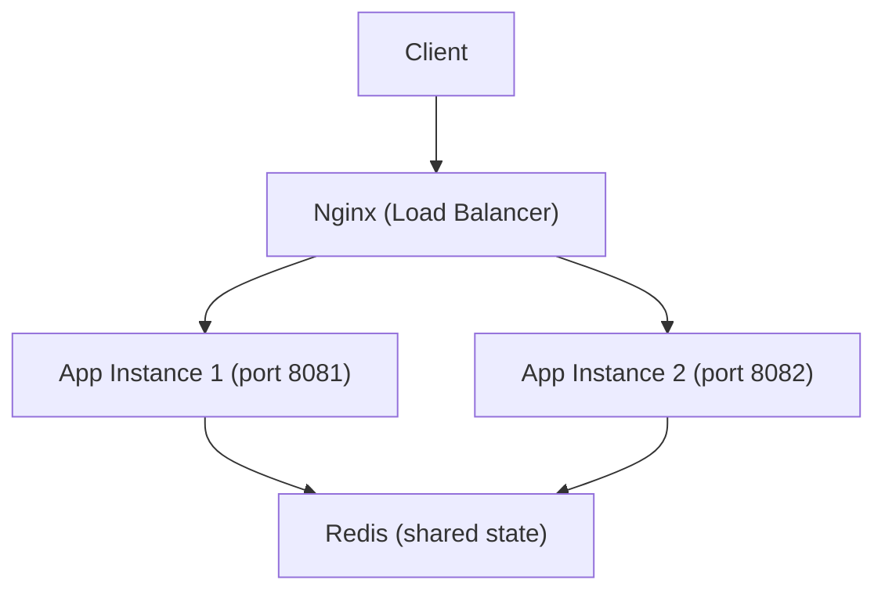

# Stock Market Simulation

A simplified stock market REST API built with Spring Boot, Redis, and Docker.

## Architecture



The system runs two application instances behind an Nginx load balancer.
Killing one instance via `POST /chaos` does not bring down the system —
the surviving instance continues serving requests, and Docker automatically
restarts the killed instance.

All state (bank stocks, wallet holdings, audit log) is stored in Redis,
shared across both instances.

## Prerequisites

- Docker

That's it. No Java or Maven installation required — the build happens inside Docker.

## Starting the Application

**Linux / macOS:**

```bash
./start.sh 8080
```
> **Note:** If `start.sh` is not executable, run `chmod +x start.sh` first.

**Windows:**
```cmd
./run.bat 8080
```
Replace `8080` with any available port. The application will be available at `http://localhost:8080`.

## Stopping the Application

Press `Ctrl+C` in the terminal, then run:
```bash
docker compose down
```


## API Endpoints

### Bank


| Method | Endpoint | Description |
|--------|----------|-------------|
| GET | `/stocks` | Returns current state of the bank |
| POST | `/stocks` | Sets the state of the bank |


### Wallets

| Method | Endpoint | Description |
|--------|----------|-------------|
| GET | `/wallets/{wallet_id}` | Returns all stocks in a wallet |
| GET | `/wallets/{wallet_id}/stocks/{stock_name}` | Returns quantity of a specific stock in a wallet |
| POST | `/wallets/{wallet_id}/stocks/{stock_name}` | Buy or sell a single stock |

### Audit Log

| Method | Endpoint | Description |
|--------|----------|-------------|
| GET | `/log` | Returns full audit log in order of occurrence |

### Chaos

| Method | Endpoint | Description |
|--------|----------|-------------|
| POST | `/chaos` | Kills the instance serving this request |

## Usage Examples

**Seed the bank:**
```bash
curl -X POST http://localhost:8080/stocks \
    -H "Content-Type: application/json" \
    -d '{"stocks": [
            {"name": "RELY", "quantity": 15}, 
            {"name":  "NVDA", "quantity": 12},  
            {"name": "AAPL", "quantity": 5}]}'
```
Response: `200 OK`

**Check the bank:**
```bash
curl http://localhost:8080/stocks
```
Response:
```json
{"stocks":[{"name":"RELY","quantity":15},{"name":"NVDA","quantity":12},{"name":"AAPL","quantity":5}]}    
```

**Buy a stock:**
```bash
curl -X POST http://localhost:8080/wallets/wallet1/stocks/AAPL \
  -H "Content-Type: application/json" \
  -d '{"type": "buy"}'
```
Response: `200 OK`


**Sell a stock:**
```bash
curl -X POST http://localhost:8080/wallets/wallet1/stocks/AAPL \
  -H "Content-Type: application/json" \
  -d '{"type": "sell"}'
```
Response: `200 OK`


**Check wallet:**
```bash
curl http://localhost:8080/wallets/wallet1
```
Response: 
```json
{"id":"wallet1","stocks":[{"name":"AAPL","quantity":1}]}`
```  
**Check audit log:**
```bash
curl http://localhost:8080/log
```

**Trigger chaos:**
```bash
curl -X POST http://localhost:8080/chaos
```

## Error Responses

| Status | Reason |
|--------|--------|
| 400 | Buying a stock with 0 quantity in the bank |
| 400 | Selling a stock the wallet doesn't own |
| 404 | Stock doesn't exist in the bank |

## Design Decisions

- **Redis as shared state** — ensures all instances see the same data. In-memory storage would cause data inconsistency across instances.
- **Nginx as load balancer** — distributes requests across both instances in round-robin. If one instance dies, Nginx routes all traffic to the surviving one.
- **Wallet auto-creation** — wallets are created implicitly on first trade, no separate creation endpoint needed.
- **Audit log ordering** — stored as a Redis List using `rightPush`, which preserves insertion order.
- **null vs 0 for bank stock quantity** — `null` means the stock never existed (404), `0` means it exists but is sold out (400).